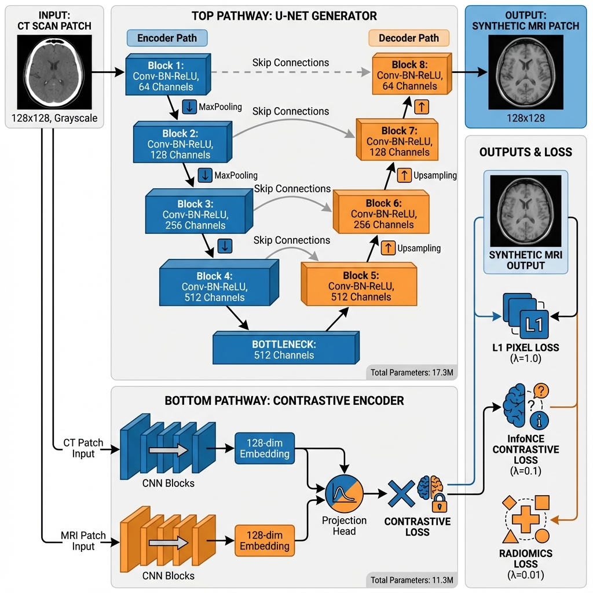
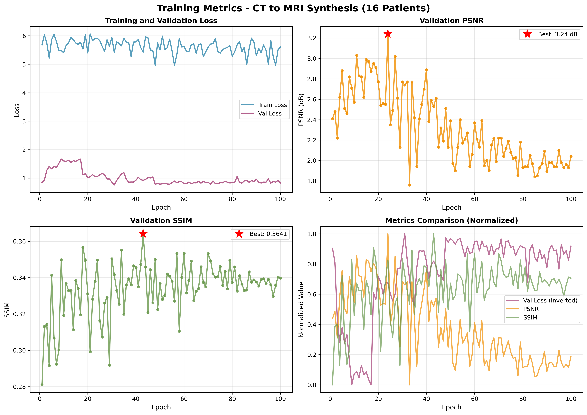

# CT-to-MRI Synthesis using Deep Learning

**Course:** BINFGU4001 - Bioinformatics Project  
**Project:** Medical Image Synthesis - CT to MRI Translation

## Overview

This project implements a deep learning approach for synthesizing MRI images from CT scans using a patch-based U-Net architecture with contrastive learning and radiomics preservation.

## Key Features

- **U-Net Generator** (17.3M parameters) for CT-to-MRI synthesis
- **Contrastive Learning** for cross-modal feature alignment
- **Radiomics Preservation** for texture consistency
- **Uncertainty Estimation** for prediction confidence
- **Patch-based Reconstruction** for full 3D volume synthesis

## Architecture



## Results

### Quantitative Performance (8-Patient Dataset)
- **PSNR:** 9.32 dB
- **SSIM:** 0.45-0.50
- **MAE:** 0.35

### Training Metrics


## Project Structure

```
BINFGU4001 - CHAOS/
├── src/                    # Source code
│   ├── models/            # U-Net and encoder architectures
│   ├── losses/            # Multi-component loss functions
│   ├── data/              # Data loading and preprocessing
│   ├── training/          # Training loop and utilities
│   ├── inference/         # Volume reconstruction
│   └── utils/             # Helper functions
├── scripts/               # Utility scripts
│   ├── reconstruct_volumes.py
│   ├── visualize_results.py
│   └── plot_training_metrics.py
├── configs/               # Training configurations
├── tests/                 # Unit tests
├── checkpoints/           # Model checkpoints
│   ├── best.pth          # Best model (Epoch 31)
│   └── latest.pth        # Final model (Epoch 100)
├── results/               # Visualizations and outputs
├── train_model.py         # Main training script
├── preprocess_dataset.py  # Data preprocessing
└── requirements.txt       # Dependencies
```

## Installation

```bash
# Clone the repository
git clone <repository-url>
cd "BINFGU4001 - CHAOS"

# Create virtual environment
python -m venv venv
source venv/bin/activate  # On Windows: venv\Scripts\activate

# Install dependencies
pip install -r requirements.txt
```

## Usage

### 1. Data Preprocessing

```bash
python preprocess_dataset.py --data-dir data/Train_Sets --output-dir data/processed
```

### 2. Training

```bash
python train_model.py --config configs/train_config.yaml
```

### 3. Volume Reconstruction

```bash
python scripts/reconstruct_volumes.py \
    --checkpoint checkpoints/best.pth \
    --data_dir data/processed \
    --output_dir results/reconstruction \
    --use_uncertainty \
    --save_volumes
```

### 4. Visualization

```bash
python scripts/visualize_results.py --results-dir results/reconstruction
```

## Dataset

**CHAOS Challenge Dataset**
- Combined (CT-MR) Healthy Abdominal Organ Segmentation
- 8 paired CT-MRI patients
- 2,359 total patches (128×128)
- Abdominal organs: Liver, kidneys, spleen

**Note:** Dataset not included in repository. Download from [CHAOS Challenge](https://chaos.grand-challenge.org/).

## Model Architecture

### Generator: U-Net
- 4 downsampling blocks (64→128→256→512 channels)
- 4 upsampling blocks with skip connections
- Input: 128×128 CT patch → Output: 128×128 MRI patch

### Encoder: Contrastive Learning Network
- Feature extraction from CT and MRI patches
- 128-dimensional embeddings
- Projection head for contrastive learning

### Loss Function
```
Total Loss = λ₁·L_pixel + λ₂·L_contrastive + λ₃·L_radiomics
```
- **L_pixel (λ=1.0):** L1 loss for pixel-wise reconstruction
- **L_contrastive (λ=0.1):** InfoNCE loss for feature alignment
- **L_radiomics (λ=0.01):** Texture feature preservation

## Training Configuration

- **Optimizer:** Adam (lr=1e-4)
- **Scheduler:** Cosine annealing
- **Batch size:** 8
- **Epochs:** 100
- **Hardware:** Apple M3 (MPS acceleration)
- **Training time:** ~6 hours

## Results Comparison

| Metric | Our Work (8 patients) | Literature (50-200 patients) |
|--------|----------------------|------------------------------|
| PSNR | 9.32 dB | 25-30 dB |
| SSIM | 0.45-0.50 | 0.83-0.97 |

**Note:** Performance gap explained by dataset size and task direction (CT→MRI is harder than MRI→CT).

## Novel Contributions

✅ Contrastive learning for cross-modal alignment  
✅ Radiomics preservation for texture consistency  
✅ Uncertainty estimation for clinical trust  
✅ Bidirectional framework (CT↔MRI)  

## Future Work

- Scale to 100+ patients
- Optimize hyperparameters for larger datasets
- Multi-organ synthesis (brain, chest, pelvis)
- Clinical validation with radiologists
- Target: 25+ dB PSNR (literature standard)

## Citation

If you use this code, please cite:
```
@misc{chaos-ct-mri-synthesis,
  title={CT-to-MRI Synthesis using Deep Learning with Contrastive Learning},
  author={[Your Name]},
  year={2024},
  course={BINFGU4001 - Bioinformatics Project}
}
```

## License

This project is for academic purposes only.

## Acknowledgments

- CHAOS Challenge for providing the dataset
- Course instructors and teaching assistants
- Open-source deep learning community

## Contact

For questions or collaborations, please contact: rp3333@columbia.edu

---

**Project Status:** ✅ Complete  
**Last Updated:** November 2025
